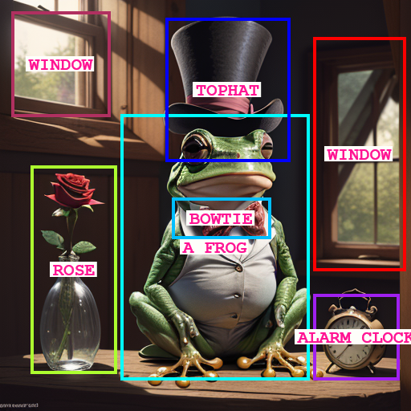

If you would like to show your appreciation for this project, please consider a donation :)  

# GLIGEN GUI

[GLIGEN](https://gligen.github.io/) is a novel way to specify the precise location of objects in text-to-image models. I present here an intuitive GUI that makes it significantly easier to use GLIGEN with ComfyUI.

## Getting Started

First of all make sure you have [ComfyUI](https://github.com/comfyanonymous/ComfyUI) successfully installed and running.

Next, download the [gligen_sd14_textbox_pruned.safetensors](https://huggingface.co/comfyanonymous/GLIGEN_pruned_safetensors/blob/main/gligen_sd14_textbox_pruned.safetensors) GLIGEN model file and place it in the ComfyUI/models/gligen directory.

Make sure you have [Flask](https://flask.palletsprojects.com/en/3.0.x/) installed

    pip install flask

Clone this repository

    git clone https://github.com/mut-ex/gligen-gui.git
    cd gligen-gui

Then to start the GUI, run the following command

    flask --app 'gligen_gui:create_app(8188)' run --port 5000

Note that this assumes your ComfyUI instance is using port 8188. If not, replace 8188 with the correct port number.

Finally, open http://127.0.0.1:5000/port/8188 in your browser to start using the GUI. However change 8188 in the URL to the port used by ComfyUI if it is different.

## How To Use

Make sure you have a Stable Diffusion 1.5 **checkpoint** selected. Usage is pretty simple and straightforward! Envision your image by drawing grounding boxes on the blank canvas with your mouse, and labeling them by entering your desired prompt in the corresponding text input in the table on the right.

You can further describe your image in the text input labelled **POSITIVE** but in my experience it works better if you only enter tags relating to the style and quality of your desired image.

If there are any LORAs you wish to use, press the **+** button in the LORA section. Then, select the name of the LORA and adjust its strength, You can add multiple LORAs.

Finally, press the Queue Prompt to submit the prompt to ComfyUI. Once the image is generated, it will appear on the canvas.
